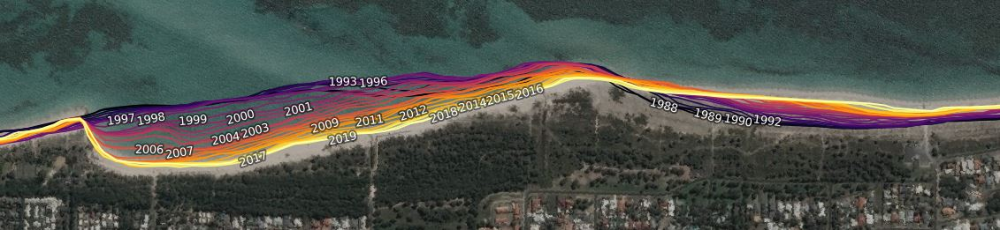
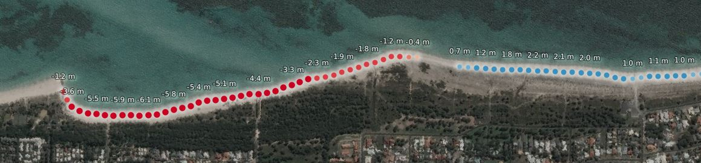
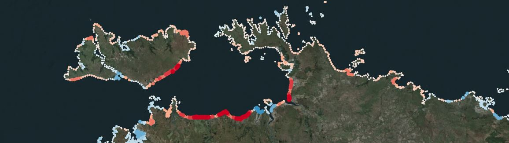

# Digital Earth Australia CoastLines

**License:** The code in this repository is licensed under the [Apache License, Version 2.0](https://www.apache.org/licenses/LICENSE-2.0). Digital Earth Australia data is licensed under the [Creative Commons by Attribution 4.0 license](https://creativecommons.org/licenses/by/4.0/).

**Contact:** For assistance with any of the Python code or Jupyter Notebooks in this repository, please post a [Github issue](https://github.com/GeoscienceAustralia/DEACoastLines/issues/new). For questions or more information about this product, sign up to the [Open Data Cube Slack](https://join.slack.com/t/opendatacube/shared_invite/zt-d6hu7l35-CGDhSxiSmTwacKNuXWFUkg) and post on the [`#dea-coastlines`](https://app.slack.com/client/T0L4V0TFT/C018X6J9HLY/details/) channel.

---

**Digital Earth Australia CoastLines** is a continental dataset that includes annual shorelines and rates of coastal change along the entire Australian coastline from 1988 to the present.  
 
The product combines satellite data from Geoscience Australia's [Digital Earth Australia program](https://www.ga.gov.au/dea) with tidal modelling to map the typical location of the coastline at mean sea level for each year. 
The product enables trends of coastal erosion and growth to be examined annually at both a local and continental scale, and for patterns of coastal change to be mapped historically and updated regularly as data continues to be acquired. 
This allows current rates of coastal change to be compared with that observed in previous years or decades.  
 
The ability to map shoreline positions for each year provides valuable insights into whether the changes to our coastline are the result of particular events or actions, or a process of more gradual change over time.
This information can enable scientists, managers and policy makers to assess impacts from the range of drivers impacting our coastlines and potentially assist planning and forecasting for future scenarios.

## Data structure and features
The **DEA CoastLines** product contains three layers:

* **Coastlines**: Annual coastline vectors from 1988 to 2019 that represent median or ‘typical’ coastline positions at approximately mean sea level tide (0 m AHD). 
   * Semi-transparent coastlines have low certainty due to either few non-cloudy satellite observations, or poor tidal modelling performance.
   

* **Statistics**: A point dataset providing robust rates of coastal change statistics for every 30 m along Australia’s non-rocky (clastic) coastlines. The most recent 2019 coastline is used as a baseline for measuring rates of change. By default, points are shown for significant rates of change only (p-value < 0.01, see sig_time below). The dataset contains the following attribute column types:
   * `dist_1990`, `dist_1991` etc: Annual coastline positions/distances (in metres) relative to the 2019 baseline coastline. Negative values indicate that an annual coastline was located inland of the 2019 baseline coastline. 
   * `rate_time`: Annual rates of change (in metres per year) calculated by linearly regressing all annual coastline distances against time. Negative values indicate erosion, while positive values indicate progradation.
   * `sig_time`: Significance (p-value) of any linear relationship between coastline distances and time. Small values (e.g. < 0.05 or < 0.01) may indicate a coastline is undergoing consistent coastal change through time.
   * `outl_time`: Individual annual coastlines are noisy estimators of coastline position that can be influenced by environmental conditions (e.g. clouds, breaking waves, sea spray) or modelling issues (e.g. poor tidal modelling results or limited clear satellite observations). To obtain robust rates of change, outlying years are excluded using a robust outlier detection algorithm, and recorded in this column.
   

* **Summary**: A point layer giving the average rate of change (in metres per year) for significant statistics points within a moving 5 km window along the coastline. This is useful for visualising regional or continental-scale patterns of coastal change.

## Key limitations and caveats
* Rates of change statistics are likely to be inaccurate or invalid in complex mouthbars, or other coastal environments undergoing rapid non-linear change through time. In these regions, it is advisable to visually assess the underlying annual coastline data when interpreting rates of change to ensure these values are fit-for-purpose. 
* Annual coastlines may be less accurate in regions with complex tidal dynamics or large tidal ranges, and low lying intertidal flats where small tidal modelling errors can lead to large horizontal offsets in coastline positions. 
* Annual coastline accuracy in intertidal environments may also be reduced by the influence of wet muddy substrate or intertidal vegetation, which can make it difficult to extract a single unambiguous coastline.
* In urban locations, the spectra of bright white buildings located near the coastline may be inadvertently confused with water, causing a land-ward offset from true coastline positions. 
* Some areas of extremely dark and persistent shadows (e.g. steep coastal cliffs across southern Australia) may be inadvertently mapped as water, resulting in a landward offset from true coastline positions.
* 1991 and 1992 coastlines are currently affected by aerosol-related issues caused by the 1991 Mount Pinatubo eruption. These coastlines should be interpreted with care, particularly across northern Australia.
