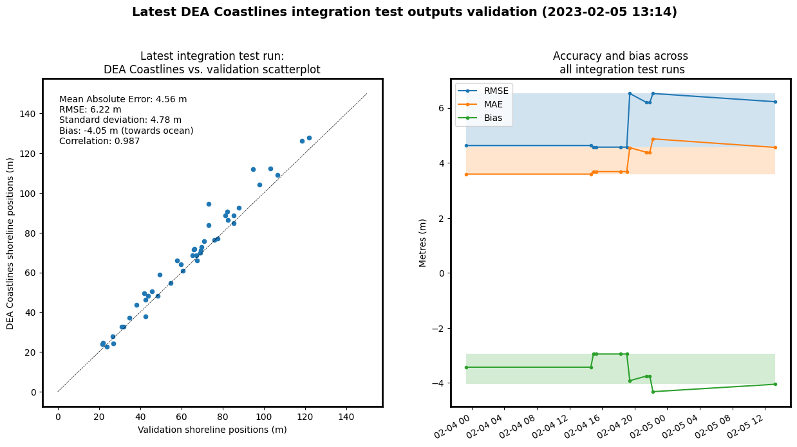

Integration tests
=================

> *This readme is automatically generated by the ``coastlines.validation.py`` script; edits should be made to the ``validation_cli`` function [located here](../coastlines/validation.py).*

This directory contains integration tests that are run to verify that the entire Coastlines code runs correctly. The ``test_coastline.py`` file runs a simple Coastlines analysis over a single beach (Narrabeen Beach in northern Sydney), using the DEA Coastlines [Command Line Interface (CLI) tools](../notebooks/DEACoastlines_generation_CLI.ipynb) to run the raster, vector, continental layers and validation analysis steps.
# Validation

In addition to testing whether the code runs without errors, we also run a small-scale validation of the results of the integration tests by comparing them to validation data from the [Narrabeen-Collaroy Beach Survey Program](https://doi.org/10.1038/sdata.2016.24). The ensures that the code both works, and generates sensible results.

> Note that this integration test validation is for a single site and a limited number of years; for a full validation of the DEA Coastlines product, refer to [Bishop-Taylor et al. 2021](https://doi.org/10.1016/j.rse.2021.112734).
## Latest integration test validation results

The latest integration test completed at **2023-08-02 11:40**. Compared to the previous run, it had an:
- RMSE accuracy of **6.16 m (:heavy_minus_sign: no change)**
- MAE accuracy of **4.84 m (:heavy_minus_sign: no change)**
- Bias of **-2.67 m (:heavy_minus_sign: no change)**
- Pearson correlation of **0.975 (:heavy_minus_sign: no change)**

